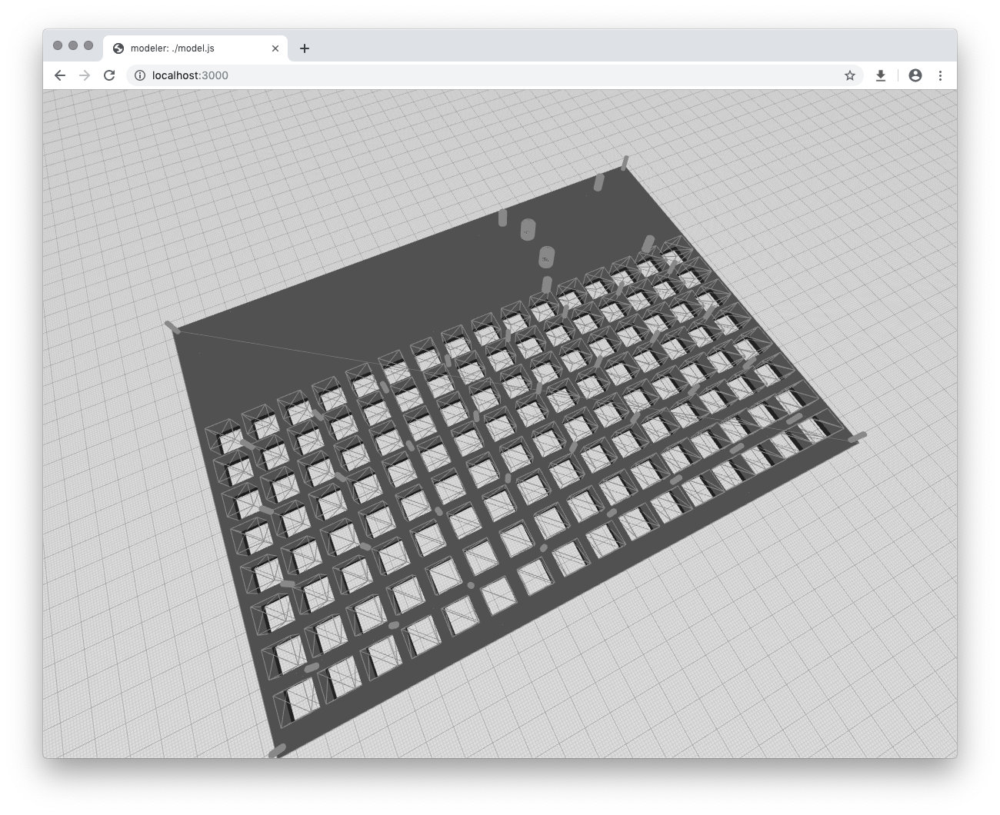
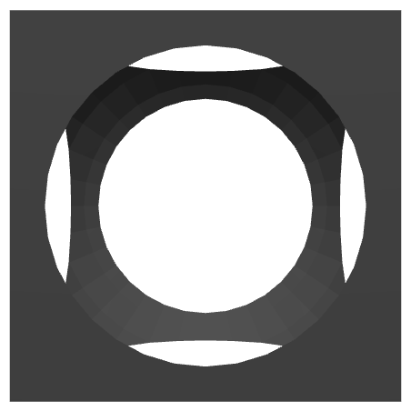

# modeler

Monorepository holding a React library, and CLI tool for [CSG](https://en.wikipedia.org/wiki/Constructive_solid_geometry) modeling.

<p>
  <div style="text-align:center">
    
  </div>
</p>


## `modeler-csg`

Main library, a custom React [reconciler](https://reactjs.org/docs/reconciliation.html), designed to work with [`react-three-fiber`](https://github.com/drcmda/react-three-fiber).

### Installation

`npm install --save modeler-csg`

### Usage

```jsx
const React = require("react");
const ReactDOM = require("react-dom");
const { Canvas } = require("react-three-fiber");
const { Model } = require("modeler-csg");

ReactDOM.render(
  <Canvas>
    <ambientLight color={0x888888} />
    <spotLight position={[0, 10, 10]} />

    <Model>
      <subtract>
        <cube />
        <sphere radius={1.3} />
      </subtract>
    </Model>
  </Canvas>,
  document.getElementById("root")
);
```

<p>
  <div style="text-align:center">
    
  </div>
</p>

### API

API follows (for the most part) [@jscad/csg docs](https://github.com/jscad/csg.js/blob/V2/docs/api.md)

#### Model

- `<Model>` props:
  - `{children}` - *shapes* and *operations*
  - `modelMaterial` - THREE material for the model (default `MeshStandardMaterial({ roughness: 1.0, metalness: 0.0, color: 0x333333 })`)
  - `partsMaterial` - THREE material for the parts (default `MeshBasicMaterial({ wireframe: true, color: 0x888888 })`)
  - `showModel` - `true/false` - show or hide model itself (default `true`)
  - `showParts` - `true/false` - show or hide parts that made the model (default `false`)

#### Shapes

- `<sphere/>` - props: `center`, `radius`, `resolution`
- `<cube/>` - props: `center`, `radius`
- `<roundedCube/>` - props: `center`, `radius`, `roundradius`, `resolution`
- `<cylinder/>` - props: `start`, `end`, `radius`, `resolution`
- `<roundedCylinder/>` - props: `start`, `end`, `radius`, `resolution`
- `<ellipticCylinder/>` - props: `start`, `end`, `radius`, `radiusStart`, `radiusEnd`, `resolution`

#### Operations

- `<union>...</union>`
- `<subtract>...</subtract>`
- `<intersect>...</intersect>`

## `modeler-cli`

Helper utility for quick sketching.

### Installation

`npm install -g modeler-cli` or `npm install --save modler-cli` for local usage

### Usage

1. create a `model.js` file:

```jsx
const React = require("react");
const { Model } = require("modeler-csg");

module.exports = () => (
  <Model>
    <subtract>
      <cube />
      <sphere radius={1.3} />
    </subtract>
  </Model>
);
```

2. run `modeler-cli preview -m model.js`

This will start local server on port `3000`, and file watcher on the `model.js` file - any changes are live updated in the web app.
The web app has a simple camera handler, and provides a grid (main grid lines are by `1cm`, secondary grid lines by `1mm`).

### STL Export

`modeler-cli` additional can compile provided model file to STL offline: `modler-cli export -m model.js -o model.stl`.

### CLI

- `preview`:
  - `-m`, `--model` - input model file
  - `-p`, `--port` - specify port
- `export`:
  - `-m`, `--model` - input model file
  - `-o`, `--out` - output STL file


